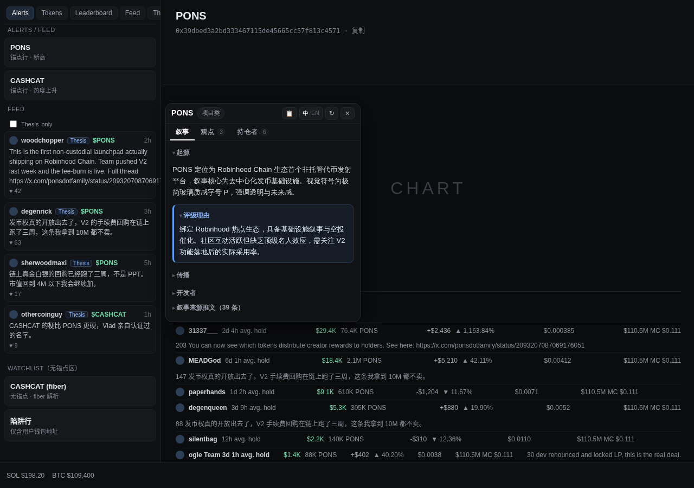

# Fomo叙事镜

**[图文说明与安装页](https://mickey-hogen.github.io/fomo-narrative-lens/)** · [下载最新版](https://github.com/mickey-hogen/fomo-narrative-lens/releases/latest) · [隐私说明](PRIVACY.md) · [更新日志](CHANGELOG.md) · MIT

一个 Chrome 扩展。在 [fomo.family](https://fomo.family) 上浏览代币时，把散落在四处的信息
聚成一张浮动卡片，回答两个问题：**这币的叙事是什么，社区在拿什么理由持仓。**

不用为了看一眼叙事另开三个标签页。

> **声明**：本扩展为独立的第三方开源工具，与 fomo.family、DeBot 及相关方**无任何隶属、
> 授权或合作关系**。所有商标归各自所有者。它只在你浏览时聚合展示公开数据，不收集你的任何信息。



---

## 卡片里有什么

**v0.8 起卡片顶部是三个标签页**（跟 fomo 自家代币页的 tab 一个用法）：

| 标签 | 内容 | 口径 |
| --- | --- | --- |
| **叙事**（默认） | DeBot 叙事（起源、评级理由、传播、开发者，中/EN 可切）+「AI 判断」（配了分析源才有）+ 叙事来源推文 | DeBot 段内容全量；**起源/评级理由默认展开，传播/开发者/来源推文默认收起**（点一下就开） |
| **观点** | Holders 表里每个持有人对这只币写的 thesis：作者、仓位、盈亏、正文、链接、点赞 | 原「Thesis 精选」段整体迁移。直接抓页面已渲染的 **Holders 表「Thesis」列**（token-specific），**按点赞降序全量列出**（不再只取前 2）、去重；行头跟 fomo 观点流一样带这位持有人的仓位与盈亏 |
| **持仓者** | 前 6 名，一行三样：`@名字 · 成本 $X · $仓位 ▲盈亏%` | 原「KOL 持仓」段整体迁移，直接抓页面已渲染的 Holders 表 |

标签只切显示，不切抓取：观点 / 持仓者的内容在后台照常抓好填好，切过去就是现成的；
观点 / 持仓者标签上的数字角标显示抓到的条数。每次开卡 / 换币都回到默认的「叙事」页。

**自动弹出默认是"精简展开"档**（v0.7.2）：代币页自动弹卡时，叙事页只摊开「起源」和
「评级理由」，传播 / 开发者 / 来源推文收成一行 `▸ 标题`，点一下才展开——卡片短、不挡图。
想一次全摊开，把设置里的「自动弹出模式」改成「全部展开」；不想自动弹，改成「不自动弹出」。

排版原则是**主体完整、其余精选**：叙事页的 DeBot 段是全量的，持仓者只取前 6，
因为卡片高度有限，塞满等于没重点；观点页自 v0.8 起独占一页，有滚动空间，所以全量列出。

DeBot 段一个字都没删，只是**默认展开状态分层**：先答"这币是什么"（起源），再给"该怎么看"
（评级理由），两段直接摊开；细节性的「传播」「开发者」默认收成一行标题，需要时点开——
第一屏先给结论，不是先给篇幅。评级理由虽然排第二，仍保留蓝色高亮框，它是这一段里唯一的判断。

持仓者页每行只留真正影响判断的三样：**谁、成本多少、现在多大仓位赚赔多少**。代币数量与
持有时长（`76.5K PONS` / `持有 2d 4h`）v0.8 起去掉——那是流水账，不是决策依据。

> **观点与持仓者怎么来的**：不调 fomo 的接口。fomo 的 `/hodlers/*` 接口现在对
> 程序化请求一律返回 403（Cloudflare 风控），带着页面自己的登录态也一样。但这些数据
> fomo 的前端**已经渲染在页面上了**，所以扩展直接读页面 DOM——零网络、绕开鉴权与风控，
> 也更稳。代价是：Holders 表得在页面上真的渲染出来，扩展才读得到（见下方限制）。
> **v0.7.4 起两页同源，都读这张 Holders 表**——观点取「Thesis」列里每个持有人写的观点
> （token-specific，稳定），不再读左栏那个各币混排的全局 Feed；观点行头的仓位/盈亏
> 也是同一张表里顺手解析的，解析不出就不显示，绝不影响正文。

**默认位置**：卡片默认停靠在左侧 Alerts 面板的右缘，压在图表区上方——既不遮住上方的
代币信息条，也不吃掉下方的 Holders 表。**你拖动过一次之后，就一直听你的**，
之后只有你自己再拖才会变（窗口缩放时也只重算"没被拖过"的默认位）。

**其他操作**：拖动头部移动卡片（位置会记住）、`Esc` 关闭、**点卡片外的空白/图表区也关闭**
（点卡片内部、右下角圆钮、左栏那些代币行都不会误关）、右下角「叙」圆钮重新打开。

**头部**（v0.7 重排）：左边是「名字 + 叙事类型」，右边一组图标钮——
`📋` 复制合约地址（不再把一长串地址摊在头上）、`📌` 固定预览、`中/EN` 切换语言 / **翻译总开关**
（v0.7.3：这是唯一的翻译入口，当前档高亮，见下文「翻译」）、`↻` 重新抓取、`×` 关闭。
星级（个人模式）单独占一行，不跟着挤。

**两种触发方式**：打开代币页自动展示（默认精简档，可在设置里改成全展开或关掉自动弹出）；
或鼠标**停在**左栏 Alerts / Feed 的某一行上浮出预览（点 📌 固定）。关掉自动弹出后，右下角的
「叙」圆钮会一直在，点它才现身。

**自动弹出会等 fomo 自己渲染完**（v0.7.1）：卡片比 fomo 的 React 快得多，早期版本会抢在页面
还是一片黑的时候就弹出来，Thesis / KOL 只能显示"还没渲染"的灰字。现在自动弹出前先确认页面
真的有东西了（左栏 tab 栏出现、正文字数够、或代币信息条画出来任一条），最多等
`PAGE_READY_MAX_MS`（1.5 秒）——到点照弹，宁可早出也不会不出。悬停预览不受影响（那时页面
显然早就加载好了）。顺带治好一个副作用：卡片不会再因为"面板还不存在"而停靠到兜底坐标上。

悬停要求的是"停住"不是"路过"：指针必须在同一行上停满 **600ms**（`HOVER_DEBOUNCE_MS`，
v0.7 从 350ms 提上来）才会加载；中途移到别的行会重新计时，所以快速划过一串行**一次都不会触发**。
嫌慢或嫌快就改这一个常量。URL/点击进代币页的自动展示与这个门槛无关。
> **v0.7.3 修了一个真 bug**：600ms 计时是"钉在同一行"上算的，而不是每收到一次 `mouseover`
> 就重置。fomo 的一行里有头像/名字/徽章/价格一堆子元素，光标在行内任何微动都会触发
> `mouseover`；旧代码每次都重置计时，600ms 永远走不完，**预览其实从来没弹出过**。现在只有
> 换行/换币才重置，行内微动只更新"到点用哪个目标解析"，dwell 照常累积到 600ms。

### DeBot 段的三条过滤规则

数据源经常返回"看着有内容、其实没内容"的字段，卡片就这么高，所以做了取舍：

1. **占位词等同空值**。字段内容去空格后如果是
   `None`／`N/A`／`NA`／`nothing`／`暂无`／`无`／`未发现`／`无明显`／`-`／`—`
   （不分大小写），按空处理，那一行不显示；某一段的所有字段都是占位词，整段消失。
2. **开发者段只在值得一提时出现**。开发者的身份/地址分析是大段套话的重灾区，
   所以只保留命中下列关键词的行：
   - 风险类：`诈骗 挪用 跑路 rug 前科 黑历史 抛售 出货 砸盘 警惕 风险
     scam fraud dump misappropriat exploit`
   - 强信号类：`回购 销毁 锁仓 买回 转移所有权 放弃所有权 实名 doxx
     renounce buyback burn lock team wallet`

   两行都没命中 → 整段不出现。

   （早期版本还显示过 fomo 的"开发者开盘次数/历史最高盘"，v0.5 起去掉了——那需要被
   Cloudflare 挡掉的 fomo 接口，开源版拿不到，不留半截功能。）

### 星级为什么默认不显示

DeBot 的 1–5 星评分是主观打分，公开版默认**不显示星级**，避免被当成投资建议。
**评级理由那段文字两版都给**——理由是有用的上下文，分数不是。
配置了自己的分析源（下面那节）就进入"个人模式"，星级会一并显示。

---

## 安装

支持 Chrome / Edge / Brave（Chromium 系）。没有构建步骤，以「已解压扩展」方式加载，
图文版见[安装页](https://mickey-hogen.github.io/fomo-narrative-lens/#install)：

1. 从 [Releases](https://github.com/mickey-hogen/fomo-narrative-lens/releases/latest) 下载 zip 并解压
   （**Windows**：右键 →「全部解压缩…」，不要在 zip 预览视图里直接选目录；**macOS**：双击自动解压）
2. 把解压出的文件夹放到一个**固定位置**（如 `C:\Extensions\` 或 `~/Documents/Extensions/`）——
   浏览器每次启动都从这里读取，放在「下载」里容易被清理误删
3. 打开 `chrome://extensions`（Edge 为 `edge://extensions`），右上角打开 **开发者模式**
4. 点 **加载已解压的扩展程序**，选中**含 `manifest.json` 的那一层**目录
5. 打开 `fomo.family`，点进任意代币页

> **关于更新**：已解压方式加载的扩展**不会自动更新**。升级 = 下载新版 zip → 覆盖原目录 →
> `chrome://extensions` 点刷新圈 ↻（或重启浏览器）。**配置不会丢**：manifest 内置固定公钥，
> 扩展 ID 恒定，换目录重装设置也都在。想收到新版提醒：GitHub 上 Watch → Custom → Releases。

## 设置

点浏览器工具栏的扩展图标。

### 通用

- **自动弹出模式**（默认 `精简展开`，v0.7.2）— 打开代币页时卡片怎么展示，三档
  （v0.8 起只管叙事页内部的展开态；观点/持仓者各占一个标签页，不受此影响）：
  - **精简展开（只显示起源+评级理由）** — 自动弹出，但叙事页只摊开「起源」「评级理由」，
    其余（传播 / 开发者 / 来源推文）都收成一行标题，点一下才展开。卡片短、不挡图。**默认就是这档。**
  - **全部展开** — 自动弹出且叙事页所有段落都摊开（v0.7.1 的老行为）。
  - **不自动弹出（点右下角按钮才显示）** — 代币页不自动弹卡；右下角的「叙」圆钮一直在，点它才现身
    （悬停预览仍然可用）。
  - 老版本的「自动弹出」开关会**自动迁移**：原来开=精简展开，原来关=不自动弹出。
- **悬停预览**（默认开）— 指针在左栏某行上停满 600ms 才预览（划过不触发）；嫌吵可关，URL 触发不受影响。
  悬停预览恒用精简布局，和自动弹出的精简档一致。
- **默认语言**（默认中文）— 卡片内随时可切，切了会记住。

这几项改完立刻生效（自动弹出模式会即时重排已开的卡片）。

### 数据源

- **分析源 URL 模板**（可选）— 填了才会出现「AI 判断」段。
- **详情页 URL 模板**（可选）— 填了才会出现「查看完整分析」链接。

两者都用 `{ca}` 占位。**默认只收 https 公网地址**：`http://`、`localhost`、`*.local`、
`10./172.16-31./192.168./127./169.254./100.64-127.` 这些内网与环回地址一律拒绝保存，
后台也不会向它们发出任何请求。原因见「数据与隐私」里的那条说明。

- **⚠️ 高级·仅自用开关**（`数据源` 组底部，默认关）：如果你把 dossier 放在**自己的**
  内网 / 局域网 / 自建服务器 / Tailscale 之类**走 http 或内网地址**的源上，勾选它才能保存
  这类地址。**公网用户不要开**——放宽后，"你浏览某个币"会变成一次由扩展代发、结果还渲染回
  卡片的内网探测（SSRF）。开关只影响你自配的分析源/详情页；**DeBot 与 FxTwitter 永远锁死
  在各自的固定公网 https 端点，不受这个开关影响**。

保存时会向你填的域名（含 http 内网源）申请访问授权（Chrome 弹窗），**拒绝则不保存**。
保存后当前卡片自动刷新。

DeBot 那一路是固定的公开端点，不需要任何配置。

---

## 接入你自己的分析源

这是这个扩展留给你的扩展点：**你有自己的一套打分/研究流程，就让卡片顶部直接显示你自己的结论。**

在设置里填（默认只收 https 公网地址；自建内网源见下方高级开关）：

```
https://你的域名/data/{ca}.json
```

扩展会把 `{ca}` 换成代币合约地址（`0x` 开头的一律转小写）后 GET 这个地址，
期望拿到这样一份 JSON：

```jsonc
{
  "address": "0xabc...",              // 必填：必须与被查询的合约地址一致，否则视为没有档案
  "updatedAt": "2026-08-31T23:14:07+08:00",
  "mode": "fast",                     // 可选：随便什么字样，原样显示成「fast 档」
  "narrative": {
    "memeHook": "这币的梗到底是什么，一句话说清",
    "tech": { "status": "running", "detail": "长文，鼠标悬停可见" }
  },
  "verdict": {
    "oneLiner": "一句话结论，显示在最上面",
    "label": "observe",               // 可选：见下表，没见过的值原样显示
    "score": 40,                      // 可选：显示成 40/100
    "scoreBreakdown": { "叙事": 13, "资金": 4 }   // 可选：悬停 score 时显示
  },
  "quant": {
    "security": {                     // 可选：只挑最严重的一条显示
      "isHoneypot": false, "canNotSell": 0,
      "buyTaxPct": 0, "sellTaxPct": 0,        // 小数，0.05 = 5%
      "top10HolderPct": 0.36,                 // 小数，0.36 = 36%
      "liquidityLocked": true,
      "flags": []                             // 自定义红旗，字符串数组
    }
  }
}
```

**所有字段都是可选的（`address` 除外），有什么显示什么。** 没有 `verdict` 也能跑，
只是那段会很短。

> 源地址默认必须是 **https 公网地址**。要用自建的内网 / 局域网 / http 源，请先在设置里勾选
> 「⚠️ 高级·仅自用」开关（有 SSRF 风险，公网用户勿开），再保存该地址。

`label` 的配色：`skip` / `no_chase` 红，`observe` 琥珀，`pullback_plan` / `tiny_starter_only` 绿；
其它值原样显示成中性色。

`updatedAt` 超过 48 小时，整段会淡化并标注"分析时点快照"，提醒你里面的市值类数字已经旧了。

找不到文件（404）、字段 `address` 对不上、或你的服务没响应（2.5 秒硬超时），
都只会让这一段显示一行灰字，**绝不影响其它四段**。

灰字只有固定的几句（「这段暂时读不到」「分析源里还没有这只币」「未授权访问分析源…」
「分析源必须是 https 公网地址…」）。**接口的原始错误串、HTTP 码、内部状态名一律不会出现在卡片上**——
那是给日志看的，不是给你看的。

---

## 数据与隐私

卡片一共碰四个地方，边界各不相同：

| 源 | 用途 | 性质 |
| --- | --- | --- |
| `app.debot.ai`（备用 `debot.ai`） | 叙事分析 | **公开接口**，不登录、不带 cookie、无 key |
| 页面 DOM（本机） | Thesis + KOL 持仓 | **零网络**，只读页面上 fomo 已渲染的内容，不发任何请求 |
| 你填的分析源 | 「AI 判断」段 | **可选**，不填就完全不存在；填了才申请该域名授权 |
| `api.fxtwitter.com` | 来源推文正文 | **公开只读**，不登录、不发帖 |

关于 fomo 的登录凭证，说清楚边界：**扩展完全不碰它**。v0.5 起 Thesis 与 KOL 持仓
改成只读页面 DOM，扩展不再向 fomo 发任何请求，也不读取、不存储、不外发页面里的任何令牌。

关于自定义分析源，说清楚为什么卡得这么死：那条请求是**由扩展后台代发的**，带着你授权的
host 权限、不受页面 CORS 约束。如果允许 `http://` 或内网地址，"你在 fomo 上看了某个币"
就会变成一次由扩展代发、结果还渲染回卡片的内网探测（SSRF）。所以：

- **默认只收 https 公网地址**，内网/环回/链路本地/CGNAT 段与裸主机名一律拒绝；
- 校验发生在**发请求之前**，被拒的地址一个字节都不会发出去；
- 设置面板与后台两处各校验一次，改设置绕不过去；
- **唯一的放宽入口是「⚠️ 高级·仅自用」开关**（默认关）：为自建内网/局域网/自建源的人保留。
  即便开了，也仍需 http(s) 协议 + 你对该来源的显式逐域名授权；DeBot / FxTwitter 两路
  与这个开关无关，始终是固定公网 https 端点；
- `optional_host_permissions` 含 `http://*/*` 与 `https://*/*`——前者只为让上面那个开关
  能对 http 内网源发起授权，**默认路径依旧是 https-公网-only**。

其它不变式：

- 除上述四处外**不向任何第三方发送数据**，不采集、不上报浏览行为；
- Thesis 与 KOL 持仓完全**不联网**：只读页面 DOM，扩展从不向 fomo 发任何请求，
  也不再读取或使用页面里的任何登录令牌；
- 缓存分档：DeBot 10 分钟、分析源 60 秒、推文 30 分钟，点「↻」强制重拉；
  分析源的缓存键带上模板本身，**换了分析源绝不会吐上一个源的旧档案**；
- 来源推文的链接一律规范化成 `https://x.com/i/status/<id>`，不采信接口返回的 url 字段；
- 渲染一律 `textContent`，绝不把接口文本当 HTML 插入；正文里的链接只有 `https://`
  开头才会变成可点锚点；卡片挂在 closed ShadowRoot 里，与页面样式互不污染。

### 翻译（v0.7.3：只剩头部一个「中/EN」开关，段内不再有译按钮/提示条）

Thesis 段与推文段用的是 **Chrome 自带的本地翻译**，内容不出浏览器，
不经过任何第三方翻译服务。

**头部的 `中/EN` 钮是唯一的翻译开关**（v0.7.3 前段内还有个「译」按钮和一条反复出现的
「点此启用中文翻译」提示条打扰阅读，已整段砍掉）：`中` = 译成中文，`EN` = 显示原文。

**语言在「中」时，这两段自动翻译，通常不用你点任何东西**，具体分几种情况：

| 浏览器状态 | 行为 |
| --- | --- |
| 语言包已就绪 | 直接翻，零点击 |
| 之前下过语言包（扩展记着 `translatorReady`） | 直接翻；万一浏览器仍要求手势，见下一行 |
| 语言包还没下载 | **不弹任何提示、不打扰**，先显示原文；你第一次点头部「中」= Chrome 要的那次用户手势，这一下下载语言包（钮上一闪「翻译中…」），装好后记住 `translatorReady`，**以后每张卡自动翻，第一次的点击永不再来** |
| 浏览器没有这个 API | 原文照常显示，**不提示、不报错**，`中/EN` 钮只在中英原文之间切 |

**只翻真正的外文**：中日文占比 ≥20% 的段落跳过（已经是中文的 thesis 不会被"再翻一遍"）。
**DeBot 段永远不翻**——它本来就有中文版，切「EN」看英文原版即可。
正文里的链接保持原样。随时点 `EN` 一键切回原文；手动切回原文后不会被自动翻译抢回去。

---

## 已知限制

- **DeBot 未收录的币没有叙事**，会显示成一行说明，这是数据侧的事实。
- **叙事有时效**：DeBot 那份分析是某个时点生成的快照，不是实时行情（v0.7.3 起卡片不再显示
  "生成于 X 前"页脚——那一整条页脚 v0.7.3 起移除）。
- **观点 / 持仓者两页依赖页面已经把 Holders 表渲染出来**（v0.7.4 起两页同源，都读这张表）。
  fomo 的表格是懒加载的：Holders 表没滚动到可见时，两页都先显示"把 Holders 表滚动到可见"的
  灰字；表在、但没人写 thesis 时，观点页显示"持有人里暂时没有写 thesis 的"。都不是报错。
  **这些灰字会自己变成真数据**：扩展在开卡后 25 秒内用 MutationObserver 盯着页面变化，
  Holders 表一画出来就自动重扫、把观点与持仓者两页一起补上，**不需要你去点「↻」**
  （v0.7.1 起有回归测试专门守这条）。点「↻」、把鼠标移回卡片、或切到观点/持仓者标签
  同样会立刻重扫，那只是手动兜底。
- **DOM 抓取靠文本特征，不靠 CSS 类名**（fomo 的类名是哈希化的）。fomo 大改版式时
  这两段可能抓空 → 退化成灰字提示，DeBot 段不受影响。两个抓取器各有一套排雷规则：
  - **Thesis**（v0.7.4 换源）：早期版本读**左栏 Feed**——那是"全局活动流"，各币混在一起，
    当前币的 thesis 只是偶尔出现在那里，于是"刚刚能抓、现在抓不到"（真实使用中反馈的问题）。现在改读
    **Holders 表的「Thesis」列**：每个持有人对这只币写下的观点，token-specific、稳定。判据是——
    ① 用列头（同时含 `Trader / Position / Avg. entry / Thesis`）定出 Thesis 列位置，按"距末尾偏移"
    折算到数据行（数据行可能多出一个没有表头的 mcap 列，不会错位）；② 读该列文本，剥掉前导点赞数
    （"147 …"→ 只留正文，点赞数移到 ♥ 角标做排序）；③ 空或只剩数字的（没写 thesis 的持有人）跳过；
    ④ 作者复用持仓者页的持有人名字解析（砍 `Team` 与 `Nd Nh avg. hold` 尾巴）；⑤ 正文里的 https/x.com
    链接照常 linkify 成可点锚点。按点赞降序全量列出（v0.8 起独占一页不再取前 2，上限 30 条防极端长表）、
    按正文去重；列头行本身与"Thesis only"过滤框/"Thesis"标签页都不会被当成条目。
    行头的仓位/盈亏装饰复用持仓者的整表解析按 handle 对号，解析不出就不显示。
  - **持仓者（KOL）**：按**列顺序**解析（第一个无符号 `$` = 仓位，带符号的 `$`/`%` = 盈亏，
    剩下的 `$` = 成本/入场价），行必须自带作者链接或头像（挡掉表头与汇总行），
    并对"不同持有人却解析出同一个仓位金额"做自检——一旦发生就改用逐单元格解析。
    名字优先取 profile 链接；没有链接时从交易者列文本里抠（线上那列长这样：
    `MEADGod Team 2d 2h avg. hold`，`Team` 与 `avg. hold` 尾巴都要砍掉）。
    最后按仓位金额取前 6。
- **开发者关键词表是固定的**（见上），命中才显示。没命中但你认为值得展示的说法，
  欢迎提 issue 补充词表。
- **fomo 前端改版可能影响悬停识别**。悬停靠行内 `/tokens/...` 链接，没有链接才回落到
  React 内部属性探测；最坏情况是悬停不出卡片，**URL 触发不受影响**。
- **悬停解析刻意保守**：同一容器里出现多个不同代币链接时宁可不解析；页脚/导航里的
  行情快捷链接一律忽略；只在视口左侧 38% 区域生效。
- **卡片不给下单按钮**，也不替你决定仓位。任何分析结论都不是执行授权。
- 只在 `https://fomo.family/*` 生效，不注入任何其它站点。

---

## 文件结构

```
manifest.json   扩展清单（MV3）
background.js   service worker：代发 DeBot / 分析源 / FxTwitter 请求 + 分档缓存 + 授权校验
content.js      页面脚本：URL/悬停监听、五段独立渲染、页面 DOM 抓取、本地自动翻译
popup.html/js   设置面板
test/           本地回归测试（不参与扩展运行，打包时排除）
  fixtures/     真实 API 响应样本 + 手工构造的持有人/开发者/占位词样本
  mock-fomo.html       模拟 fomo 左栏 + 页脚 + React fiber 行的测试页
  run-render-test.mjs  puppeteer 渲染回归
  screenshots/         测试产出的截图
```

### 跑测试

```bash
node test/run-render-test.mjs
```

依赖全局 `puppeteer-core` 与 `/usr/bin/chromium`，扩展本体零依赖、零构建。

测试用 fixture 桩掉 DeBot 与推文接口，但**分析源那条路径是真跑的**：
harness 起一个本地 **https** 服务（自签证书 + `--host-resolver-rules` 把 `analysis.test`
指到本机——v0.6 起分析源必须是 https 公网地址，测试站点也得长成那样），
注入真实的 `background.js`，完整验证 `{ca}` 替换、身份校验、404、慢响应、授权拒绝
与内网/明文地址拦截。测试起 https 与 http 两个站点，专门覆盖高级开关：**开关关时 http/内网
源零请求拦下、开关开时 http 内网源被放行并真的取回文档**。共 62 步，覆盖：

公开版首屏（无星级/有评级理由/无估值）/ **页脚整段移除（无"生成于"/无页脚版"在 DeBot 打开"）** /
默认停靠位置 / **头部单行** /
**标签页结构（v0.8：叙事默认 / 观点 / 持仓者，切换只换 pane、换币回默认叙事、角标条数、
旧段级折叠移除）** /
**DeBot 段顺序（起源→评级理由→传播→开发者）与默认展开态分层** / 开发者关键词门 /
占位词折叠 / 中英切换 / 悬停预览 / **划过多行不触发预览、停稳 600ms 才触发** /
**同一行不同子元素连点 mouseover 不饿死 dwell 计时（v0.7.3 核心 bug 修复）** /
**换币立刻清场（轮询与点击两条路都不残留上一只币）** / 空状态 / 页脚链接排除 / 钱包地址陷阱 / fiber 解析 / 未配置时分析段不存在 /
个人模式星级与分析源渲染 / meme 点截断展开 / 身份不符 / 未授权提示 /
慢响应不拖累主段 / **分析源默认 https 公网准入（http 与内网 IP 均零请求拦下）** /
**高级开关 ON 放行 http/内网自建源并成功取回** /
**错误态不泄露任何内部字符串** / **持仓者六行三段式（@名字·成本·仓位盈亏）与配色** / **按列解析：六行仓位互不相同、
无作者锚的汇总行不入榜、无链接行也能抠出名字** / 观点按币过滤 /
**观点页从 Holders 表「Thesis」列抓（作者=持有人 / 点赞降序全量 / 去重 / 剥前导点赞数 /
行头带作者仓位盈亏 / x.com 可点）** /
**列头/过滤框/标签页上的假 "Thesis" 不被误抓** /
**Holders 表在但没人写 thesis → 专属灰字** / 两个抓取器的灰字降级 /
**晚渲染的 Holders 表零点击自动补上观点+持仓者两页** /
**慢页面时卡片先等页面渲染（含 1.5s 上限兜底）** / URL 轮询自动开卡 / 推文折叠与链接规范化 / 无翻译 API 时降级 /
**点卡片外关闭（点卡片内/左栏行/圆钮不关）** / **头部「中/EN」单一翻译开关（自动翻/点「中」手势下载/
缺手势静默退回/记住已就绪/无翻译 API 降级/英文不自动翻，段内无译按钮无提示条）** /
设置面板与其 https 校验 / 发布文件无私有信息门禁 / manifest 版本与权限面。

---

## 许可

MIT，全文见 [LICENSE](LICENSE)。
