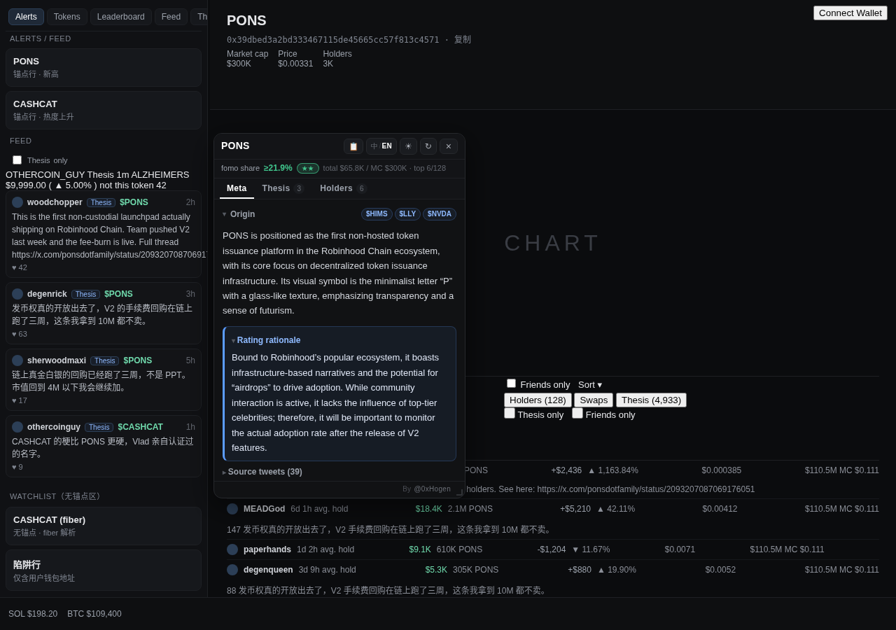
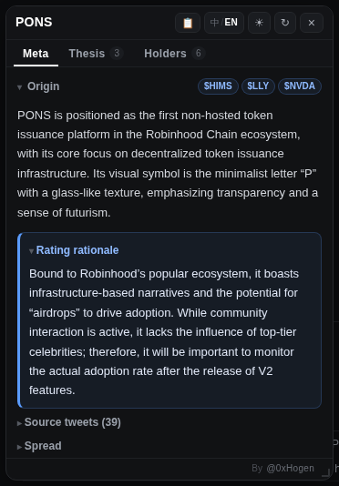
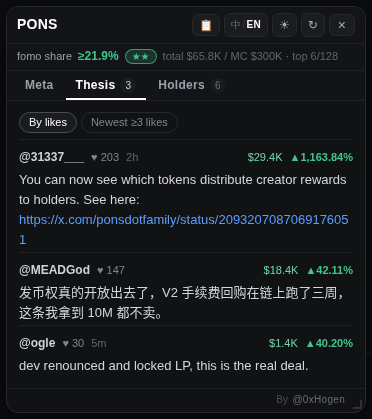
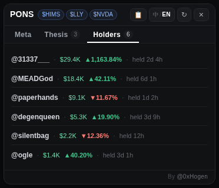
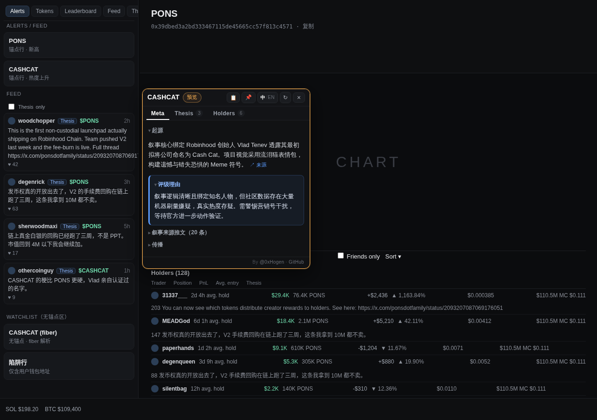
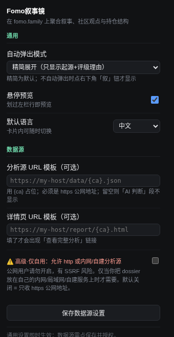

# Fomo Helper (Fomo放大镜)

**English** · [中文](README.zh-CN.md)

While browsing tokens on [fomo.family](https://fomo.family), one floating card pulls together the DeBot narrative, the community's theses, the holder structure and the source tweets — no more opening three tabs just to glance at a narrative.

No backend · collects nothing · MIT · injects only on fomo.family · Chrome / Edge / Brave

[⬇ Download latest zip](https://github.com/mickeyhogen/fomo-helper/releases/latest) · [Guide](https://hogen.pro/fomo-helper) · [Privacy](PRIVACY.md) · [Changelog](CHANGELOG.md) · by [@0xHogen](https://x.com/0xHogen)

The card docks at the right edge of the left panel, over the chart area — it never covers the token info bar or the Holders table below.

## What's in the card

Open any token page and the card pops up (closable). The three tabs are three layers of the same question: what story does this token tell, why does the community hold it, and who actually put money in.

### Meta — what this token is

DeBot's full narrative analysis: origin and rating rationale open by default; source tweets / spread / dev collapse into one-line headers. Placeholder boilerplate ("none", "not found"…) is filtered out. The small blue chips next to the ticker are the token's **secondary-pool pairs** (e.g. `$HIMS` `$LLY` `$NVDA`) — main pools everyone has (ETH / stablecoins) are hidden; hover a chip for pool liquidity.

### Thesis — in the holders' own words

Every thesis written for *this* token by holders in the Holders table: sorted by likes, de-duplicated, each row headed by that holder's position and PnL — see how much they bet before reading their reasoning. Switch between **By likes** and **Newest ≥2 likes** at the top; *Newest* reads fomo's own thesis feed, newest first with post time. Non-English theses can be auto-translated (Chrome's built-in translator), original kept.

### Holders — who actually put money in

Top 6 by position, one line each: who, how big, up or down how much, held how long (`@name · $27.4K ▲34.76% · held 2d 4h`). Avg. entry shows on hover; token counts and other ledger noise stay off the card.

### Hover preview — no click needed

Rest the mouse on a row in the left Alerts / Feed panel for 0.6 s and a preview card for that token floats up; 📌 pins it. Sweeping quickly across rows won't trigger it.

### Everything adjustable

Auto-open mode (compact / full / off), default language and the hover-preview switch live in the extension icon's settings panel. That's all — no account, no login, nothing to fill in. `中/EN` in the card header switches language any time.

## What it can and cannot touch

It has no backend, so "secretly uploading" is something it structurally cannot do. There is no server code and no account system in this project. Settings live only in your browser's local `chrome.storage` and vanish on uninstall. It never reads your fomo session — the Thesis and Holders tabs read what fomo has already rendered on the page, without a single network request. It only exists on the `fomo.family` domain.

Fetching the narrative, tweets and pools does query three third-party public endpoints; their servers can see "some IP looked up some token" in their own logs. That is unavoidable for a pull-based tool — but it isn't us collecting anything: we have no server to receive it. If that bothers you, use only the Thesis / Holders tabs, which make zero requests.

| Touchpoint | Purpose | Nature |
|---|---|---|
| `app.debot.ai` | token narrative analysis | public endpoint, no login, no cookies, no key |
| `fomo.family` page DOM | Thesis and Holders | zero network: reads already-rendered content, never your session |
| `api.fxtwitter.com` | source tweet text | public read-only, no login, no posting |
| `api.dexscreener.com` | secondary-pool pair chips | public read-only, no login, no key |

There is no "custom data source" feature in the public build: that would mean the extension fetching an arbitrary address on your behalf — once published, an entry point for internal-network probing. So the setting doesn't exist, the request path doesn't exist, and the manifest requests no wildcard host permissions. Details in [PRIVACY.md](PRIVACY.md).

## Install

No app store — load the source folder directly, one minute. Works in Chrome / Edge / Brave (not Safari or Firefox).

1. **Download and unzip** — [get the latest zip](https://github.com/mickeyhogen/fomo-helper/releases/latest) and unzip it to a `fomo-helper` folder. On Windows, right-click → "Extract All…"; don't just double-click into the zip.
2. **Put the folder somewhere permanent** — e.g. `~/Documents/Extensions/` (Windows `C:\Extensions\`). The browser loads the extension from this folder on every start; leave it in Downloads and one cleanup wipes it.
3. **Enable Developer mode** — go to `chrome://extensions` (`edge://extensions` on Edge) and switch on **Developer mode** at the top right.
4. **Load unpacked** — click the button and pick the folder containing `manifest.json`. The icon appears in the toolbar when it's in.
5. **Open fomo.family** — open any token page; the card pops up. No login, no sync, nothing else to set up.

**Update:** download the new zip, unzip over the same folder, then hit ↻ on the extension's card in `chrome://extensions`. Settings survive — the extension ID is fixed, so moving or reinstalling the folder keeps them too. For release notifications: Watch → Custom → Releases on GitHub.

## When something looks off

- **Installed, but nothing shows up** — it only runs on `fomo.family`. Refresh the fomo page first; if still nothing, check it's enabled in `chrome://extensions`, hit ↻, and come back. When auto-open is off, the `🔍` button at the bottom-right of a token page opens the card.
- **Thesis / Holders are empty, or show less than the page** — check whether fomo's **Friends only** filter is on. These tabs read what the page has rendered; with the filter on the table only holds friends, so that's all the extension can see. Switch the filter back to all; the empty state says so when it detects this.
- **Thesis / Holders stay empty while the browser is translating the page** — page translation rewrites the English text in fomo's table, so the extension can't recognise it. Address-bar translate icon → "Show original" (or "Never translate this site") → refresh. The empty state says so when it detects this.
- **Thesis / Holders show a grey "scroll the Holders table into view"** — fomo's table is lazy-loaded. Once it renders, the card fills itself within 25 s; scrolling the table into view triggers it immediately. Grey text isn't an error.
- **No post times in *Newest*** — the *Newest* mode reads fomo's thesis feed; open that tab once.
- **"No narrative" for this token** — DeBot has no record for it. That's the data. Thesis / Holders are unaffected.
- **Will it touch my fomo session or wallet?** — No. It sends no requests to fomo, never reads, stores or sends any token, and has no wallet permissions.
- **Why no star rating?** — DeBot's 1–5 stars are a subjective score; the public build hides them so they aren't mistaken for investment advice. The rating rationale text stays.
- **Do updates lose settings? What about another computer?** — Updating, moving or reinstalling in the same browser keeps everything. Another computer / browser doesn't follow — all data is local only; that's the price of the privacy design.
- **fomo redesigned and some content stopped showing** — Thesis / Holders parse the page by text features (fomo's CSS class names are hashed), so a big redesign can degrade them to a grey hint; Meta is unaffected. Please open an [issue](https://github.com/mickeyhogen/fomo-helper/issues) — fixes are usually quick.

---

Fomo Helper is an independent third-party open-source tool with no affiliation, endorsement or partnership with fomo.family, DeBot or any related party; all trademarks belong to their owners. Everything shown on the card is public data; nothing here is investment advice.

MIT © 2026 [0xHogen](https://x.com/0xHogen) · design notes (中文): [docs/DETAILS.zh-CN.md](docs/DETAILS.zh-CN.md)
