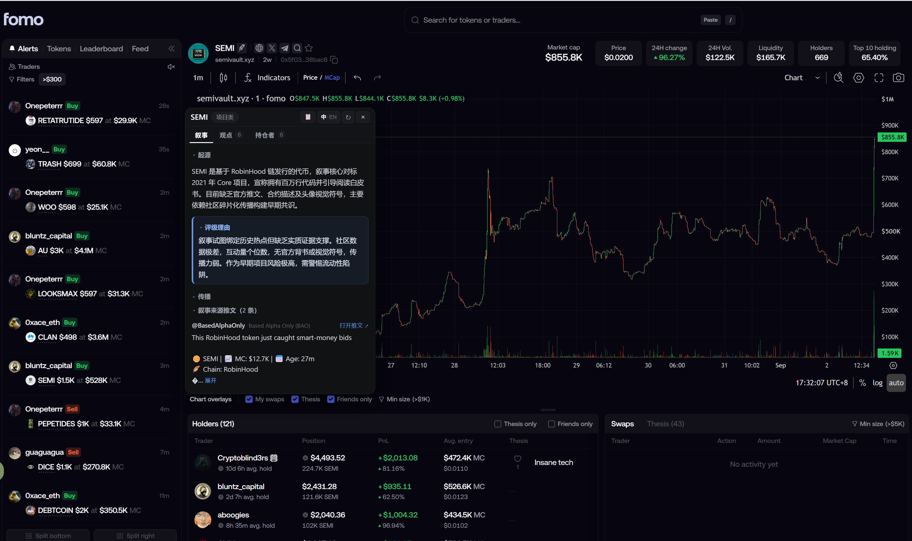

# Fomo Helper (Fomo放大镜)

**English** · [中文](README.zh-CN.md)

A Chrome extension for [fomo.family](https://fomo.family). Open any token page and one card shows the narrative (**Meta**), every holder's thesis (**Thesis**), the top holders (**Holders**) and the token's secondary-pool pairs. No backend, collects nothing.

[Guide](https://hogen.pro/fomo-helper) · [Download](https://github.com/mickeyhogen/fomo-helper/releases/latest) · [Privacy](PRIVACY.md) · [Changelog](CHANGELOG.md) · [@0xHogen](https://x.com/0xHogen)

## How to use

1. [Download the zip](https://github.com/mickeyhogen/fomo-helper/releases/latest) and unzip → `fomo-helper/`
2. `chrome://extensions` → turn on **Developer mode** → **Load unpacked** → pick the `fomo-helper` folder
3. Open any token on `fomo.family` — the card pops up

- **Thesis** tab: switch between *By likes* and *Newest ≥2 likes* at the top.
- Hover a row in the left panel for 0.6 s to preview that token; `中/EN` switches the card language.
- Drag the header to move; `Esc` or click outside to close; `🔍` bottom-right reopens.
- Settings (auto-open mode, hover preview, language) are under the extension icon.
- **Update:** unzip the new version over the same folder, then hit ↻ on the extension card.

## Notes

- Runs only on `fomo.family`. Talks to four fixed public endpoints (DeBot, FxTwitter, DexScreener, and the page itself); never touches your fomo session, cookies or wallet. See [PRIVACY.md](PRIVACY.md).
- Thesis / Holders read what fomo currently shows. With **Friends only** on, you only see friends — the card says so.
- The Holders table is lazy-loaded; scroll it into view once and the card fills itself.
- *Newest* sorting needs fomo's thesis feed rendered — open that tab once.
- No DeBot record → "no narrative". That's the data, not the extension.
- A fomo redesign can degrade Thesis / Holders to a grey hint — please open an issue.

MIT © 2026 [0xHogen](https://x.com/0xHogen) · design notes (中文): [docs/DETAILS.zh-CN.md](docs/DETAILS.zh-CN.md)
