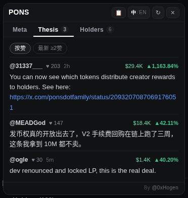

# Fomo放大镜

**[图文说明与安装页](https://hogen.pro/fomo-helper)** · [下载最新版](https://github.com/mickeyhogen/fomo-helper/releases/latest) · [隐私说明](PRIVACY.md) · [更新日志](CHANGELOG.md) · MIT · twitter: [@0xHogen](https://x.com/0xHogen)

一个 Chrome 扩展。在 [fomo.family](https://fomo.family)
上浏览代币时，把散落在四处的信息聚成一张浮动卡片，回答两个问题：**这币的叙事是什么，
社区在拿什么理由持仓。**

不用为了看一眼叙事另开三个标签页。

> **声明**：本扩展为独立的第三方开源工具，与 fomo.family、DeBot 及相关方**无任何隶属、
> 授权或合作关系**。所有商标归各自所有者。它只在你浏览时聚合展示公开数据，不收集你的任何信息。


### 界面一览

| | |
| --- | --- |
|  |  |
| **Thesis 页 · 按赞（默认）**：全量持有人 thesis，行头带仓位/盈亏 | **Thesis 页 · 最新 ≥2赞**：直接读 fomo 自家评论流，时间新→旧 |
|  |  |
| **Holders 页**：仓位 · 盈亏 · 持有时长（成本悬停可见） | **头部副池交易对**：`$HIMS $LLY $NVDA` 这类非常规池（DexScreener） |

---

## 卡片里有什么

**v0.8 起卡片顶部是三个标签页**（跟 fomo 自家代币页的 tab 一个用法）：

| 标签 | 内容 | 口径 |
| --- | --- | --- |
| **Meta**（默认） | DeBot 叙事（起源、评级理由、传播、开发者，中/EN 可切）+ 叙事来源推文 | DeBot 段内容全量；**起源/评级理由默认展开，传播/开发者/来源推文默认收起**（点一下就开） |
| **Thesis** | Holders 表里每个持有人对这只币写的 thesis：作者、仓位、盈亏、正文、链接、点赞、发言时间（见下）；页顶可切排序：**按赞（默认）/ 最新 ≥2赞**（最新档直接读 fomo 自家评论流——开过那个 tab 才有数据） | 原「Thesis 精选」段整体迁移。直接抓页面已渲染的 **Holders 表「Thesis」列**（token-specific），**按点赞降序全量列出**（不再只取前 2）、去重；行头跟 fomo 观点流一样带这位持有人的仓位与盈亏 |
| **Holders** | 前 6 名，一行：`@名字 · $仓位 ▲盈亏% · 持有 2d 4h`（成本悬停可见） | 原「KOL 持仓」段整体迁移，直接抓页面已渲染的 Holders 表 |

标签只切显示，不切抓取：Thesis / Holders 的内容在后台照常抓好填好，切过去就是现成的；
Thesis / Holders 标签上的数字角标显示抓到的条数。每次开卡 / 换币都回到默认的「Meta」页。

**自动弹出默认是"精简展开"档**（v0.7.2）：代币页自动弹卡时，Meta 页只摊开「起源」和
「评级理由」，传播 / 开发者 / 来源推文收成一行 `▸ 标题`，点一下才展开——卡片短、不挡图。
想一次全摊开，把设置里的「自动弹出模式」改成「全部展开」；不想自动弹，改成「不自动弹出」。

排版原则是**主体完整、其余精选**：Meta 页的 DeBot 段是全量的，持仓者只取前 6，
因为卡片高度有限，塞满等于没重点；Thesis 页自 v0.8 起独占一页，有滚动空间，所以全量列出。

DeBot 段一个字都没删，只是**默认展开状态分层**：先答"这币是什么"（起源），再给"该怎么看"
（评级理由），两段直接摊开；细节性的「传播」「开发者」默认收成一行标题，需要时点开——
第一屏先给结论，不是先给篇幅。评级理由虽然排第二，仍保留蓝色高亮框，它是这一段里唯一的判断。

Holders 页每行：**谁、现在多大仓位赚赔多少、拿了多久**（`持有 2d 4h`）。成本挤换行了，
v0.8.8 起撤出行内、悬停整行可见；代币数量（`76.5K PONS`）仍不显示。

> **Thesis 与 Holders 怎么来的**：不调 fomo 的接口。fomo 的 `/hodlers/*` 接口现在对
> 程序化请求一律返回 403（Cloudflare 风控），带着页面自己的登录态也一样。但这些数据
> fomo 的前端**已经渲染在页面上了**，所以扩展直接读页面 DOM——零网络、绕开鉴权与风控，
> 也更稳。代价是：Holders 表得在页面上真的渲染出来，扩展才读得到（见下方限制）。
> **v0.7.4 起两页同源，都读这张 Holders 表**——Thesis 页取「Thesis」列里每个持有人写的观点
> （token-specific，稳定），不再读左栏那个各币混排的全局 Feed；Thesis 行头的仓位/盈亏
> 也是同一张表里顺手解析的，解析不出就不显示，绝不影响正文。

**默认位置**：卡片默认停靠在左侧 Alerts 面板的右缘，压在图表区上方——既不遮住上方的
代币信息条，也不吃掉下方的 Holders 表。**你拖动过一次之后，就一直听你的**，
之后只有你自己再拖才会变（窗口缩放时也只重算"没被拖过"的默认位）。

**其他操作**：拖动头部移动卡片（位置会记住）、`Esc` 关闭、**点卡片外的空白/图表区也关闭**
（点卡片内部、右下角圆钮、左栏那些代币行都不会误关）、右下角「🔍」圆钮重新打开。

**头部**（v0.7 按主人反馈重排）：左边是「名字 + 副池交易对」（v0.8.6 起叙事类型 chip 移除腾位置，
类型悬停名字可见），右边一组图标钮——
类型 chip 右侧的小蓝 chips（v0.8.3，v0.8.5 收窄）是这只币的**副池交易对**（如 `$TSLA $HIMS`）——
ETH/稳定币这类谁都有的主池**不占位**，只显示有信息量的非常规配对；数据来自 DexScreener 公开接口，
按流动性排序、最多 4 个，悬停看全量池子（含主池）与各池流动性；没有副池或取不到就整组不显示。
`📋` 复制合约地址（不再把一长串地址摊在头上）、`📌` 固定预览、`中/EN` 切换语言 / **翻译总开关**
（v0.7.3：这是唯一的翻译入口，当前档高亮，见下文「翻译」）、`↻` 重新抓取、`×` 关闭。


**两种触发方式**：打开代币页自动展示（默认精简档，可在设置里改成全展开或关掉自动弹出）；
或鼠标**停在**左栏 Alerts / Feed 的某一行上浮出预览（点 📌 固定）。关掉自动弹出后，右下角的
「🔍」圆钮会一直在，点它才现身。

**自动弹出会等 fomo 自己渲染完**（v0.7.1）：卡片比 fomo 的 React 快得多，早期版本会抢在页面
还是一片黑的时候就弹出来，Thesis / KOL 只能显示"还没渲染"的灰字。现在自动弹出前先确认页面
真的有东西了（左栏 tab 栏出现、正文字数够、或代币信息条画出来任一条），最多等
`PAGE_READY_MAX_MS`（1.5 秒）——到点照弹，宁可早出也不会不出。悬停预览不受影响（那时页面
显然早就加载好了）。顺带治好一个副作用：卡片不会再因为"面板还不存在"而停靠到兜底坐标上。

悬停要求的是"停住"不是"路过"：指针必须在同一行上停满 **600ms**（`HOVER_DEBOUNCE_MS`，
v0.7 从 350ms 提上来）才会加载；中途移到别的行会重新计时，所以快速划过一串行**一次都不会触发**。
嫌慢或嫌快就改这一个常量。URL/点击进代币页的自动展示与这个门槛无关。
> **v0.7.3 修了一个真 bug**：600ms 计时是"钉在同一行"上算的，而不是每收到一次 `mouseover`
> 就重置。fomo 的一行里有头像/名字/徽章/价格一堆子元素，光标在行内任何微动都会触发
> `mouseover`；旧代码每次都重置计时，600ms 永远走不完，**预览其实从来没弹出过**。现在只有
> 换行/换币才重置，行内微动只更新"到点用哪个目标解析"，dwell 照常累积到 600ms。

### DeBot 段的三条过滤规则

数据源经常返回"看着有内容、其实没内容"的字段，卡片就这么高，所以做了取舍：

1. **占位词等同空值**。字段内容去空格后如果是
   `None`／`N/A`／`NA`／`nothing`／`暂无`／`无`／`未发现`／`无明显`／`-`／`—`
   （不分大小写），按空处理，那一行不显示；某一段的所有字段都是占位词，整段消失。
2. **开发者段只在值得一提时出现**。开发者的身份/地址分析是大段套话的重灾区，
   所以只保留命中下列关键词的行：
   - 风险类：`诈骗 挪用 跑路 rug 前科 黑历史 抛售 出货 砸盘 警惕 风险
     scam fraud dump misappropriat exploit`
   - 强信号类：`回购 销毁 锁仓 买回 转移所有权 放弃所有权 实名 doxx
     renounce buyback burn lock team wallet`

   两行都没命中 → 整段不出现。

   （早期版本还显示过 fomo 的"开发者开盘次数/历史最高盘"，v0.5 起去掉了——那需要被
   Cloudflare 挡掉的 fomo 接口，开源版拿不到，不留半截功能。）

### 星级为什么默认不显示

DeBot 的 1–5 星评分是主观打分，公开版默认**不显示星级**，避免被当成投资建议。
**评级理由那段文字两版都给**——理由是有用的上下文，分数不是。
（自用版配置了分析源后会显示星级；公开版不含该能力。）

---

## 安装

没有构建步骤，直接加载源目录：

1. 从本仓库 **Code → Download ZIP** 下载并解压（或 `git clone`）
2. 打开 Chrome，地址栏输入 `chrome://extensions`
3. 右上角打开 **开发者模式**
4. 点 **加载已解压的扩展程序**
5. 选中解压出来的目录（含 `manifest.json` 的那一层）
6. 打开 `fomo.family`，点进任意代币页

> **关于更新**：这是以「已解压扩展」方式加载的，**不会自动更新**。想升级到新版本，
> 回本仓库重新下载、覆盖原目录，再到 `chrome://extensions` 点该扩展卡片上的刷新圈 ↻ 即可。
>
> `test/` 只是本地回归测试，不影响运行。

---

## 设置

点浏览器工具栏的扩展图标。

### 通用

- **自动弹出模式**（默认 `精简展开`，v0.7.2）— 打开代币页时卡片怎么展示，三档
  （v0.8 起只管 Meta 页内部的展开态；Thesis/Holders 各占一个标签页，不受此影响）：
  - **精简展开（只显示起源+评级理由）** — 自动弹出，但 Meta 页只摊开「起源」「评级理由」，
    其余（传播 / 开发者 / 来源推文）都收成一行标题，点一下才展开。卡片短、不挡图。**默认就是这档。**
  - **全部展开** — 自动弹出且 Meta 页所有段落都摊开（v0.7.1 的老行为）。
  - **不自动弹出（点右下角按钮才显示）** — 代币页不自动弹卡；右下角的「🔍」圆钮一直在，点它才现身
    （悬停预览仍然可用）。
  - 老版本的「自动弹出」开关会**自动迁移**：原来开=精简展开，原来关=不自动弹出。
- **悬停预览**（默认开）— 指针在左栏某行上停满 600ms 才预览（划过不触发）；嫌吵可关，URL 触发不受影响。
  悬停预览恒用精简布局，和自动弹出的精简档一致。
- **默认语言**（默认中文）— 卡片内随时可切，切了会记住。

这几项改完立刻生效（自动弹出模式会即时重排已开的卡片）。

---

---

## 数据与隐私

卡片一共碰四个地方，边界各不相同：

| 源 | 用途 | 性质 |
| --- | --- | --- |
| `app.debot.ai`（备用 `debot.ai`） | 叙事分析 | **公开接口**，不登录、不带 cookie、无 key |
| 页面 DOM（本机） | Thesis + KOL 持仓 | **零网络**，只读页面上 fomo 已渲染的内容，不发任何请求 |
| `api.fxtwitter.com` | 来源推文正文 | **公开只读**，不登录、不发帖 |
| `api.dexscreener.com` | 池子交易对 chips | **公开只读**，不登录、无 key，固定端点不受任何开关影响 |

关于 fomo 的登录凭证，说清楚边界：**扩展完全不碰它**。v0.5 起 Thesis 与 KOL 持仓
改成只读页面 DOM，扩展不再向 fomo 发任何请求，也不读取、不存储、不外发页面里的任何令牌。

**公开版没有"自定义数据源"这个功能。**早期自用版允许填自己的分析源，那意味着扩展要替你去访问
一个任意地址——这类能力一旦公开发布，就是别人拿来做内网探测的入口。所以公开版把这条路整个拆了：
设置面板里没有这一项，代码里没有对应的请求路径，manifest 里也不再申请任何通配域名权限。
它能访问的就是上面表里那几个固定域名，多一个都没有。

其它不变式：

- 除上述四处外**不向任何第三方发送数据**，不采集、不上报浏览行为；
- Thesis 与 KOL 持仓完全**不联网**：只读页面 DOM，扩展从不向 fomo 发任何请求，
  也不再读取或使用页面里的任何登录令牌；
- 缓存分档：DeBot 10 分钟、DexScreener 10 分钟、推文 30 分钟，点「↻」强制重拉；
- 来源推文的链接一律规范化成 `https://x.com/i/status/<id>`，不采信接口返回的 url 字段；
- 渲染一律 `textContent`，绝不把接口文本当 HTML 插入；正文里的链接只有 `https://`
  开头才会变成可点锚点；卡片挂在 closed ShadowRoot 里，与页面样式互不污染。

### 翻译（v0.7.3：只剩头部一个「中/EN」开关，段内不再有译按钮/提示条）

Thesis 段与推文段用的是 **Chrome 自带的本地翻译**，内容不出浏览器，
不经过任何第三方翻译服务。

**头部的 `中/EN` 钮是唯一的翻译开关**（v0.7.3 前段内还有个「译」按钮和一条反复出现的
「点此启用中文翻译」提示条，主人嫌烦，已整段砍掉）：`中` = 译成中文，`EN` = 显示原文。

**语言在「中」时，这两段自动翻译，通常不用你点任何东西**，具体分几种情况：

| 浏览器状态 | 行为 |
| --- | --- |
| 语言包已就绪 | 直接翻，零点击 |
| 之前下过语言包（扩展记着 `translatorReady`） | 直接翻；万一浏览器仍要求手势，见下一行 |
| 语言包还没下载 | **不弹任何提示、不打扰**，先显示原文；你第一次点头部「中」= Chrome 要的那次用户手势，这一下下载语言包（钮上一闪「翻译中…」），装好后记住 `translatorReady`，**以后每张卡自动翻，第一次的点击永不再来** |
| 浏览器没有这个 API | 原文照常显示，**不提示、不报错**，`中/EN` 钮只在中英原文之间切 |

**只翻真正的外文**：中日文占比 ≥20% 的段落跳过（已经是中文的 thesis 不会被"再翻一遍"）。
**DeBot 段永远不翻**——它本来就有中文版，切「EN」看英文原版即可。
正文里的链接保持原样。随时点 `EN` 一键切回原文；手动切回原文后不会被自动翻译抢回去。

---

## 已知限制

- **DeBot 未收录的币没有叙事**，会显示成一行说明，这是数据侧的事实。
- **叙事有时效**：DeBot 那份分析是某个时点生成的快照，不是实时行情（v0.7.3 起卡片不再显示
  "生成于 X 前"页脚——那一整条页脚已按主人要求移除）。
- **Thesis / Holders两页依赖页面已经把 Holders 表渲染出来**（v0.7.4 起两页同源，都读这张表）。
  fomo 的表格是懒加载的：Holders 表没滚动到可见时，两页都先显示"把 Holders 表滚动到可见"的
  灰字；表在、但没人写 thesis 时，Thesis 页显示"持有人里暂时没有写 thesis 的"。都不是报错。
  **这些灰字会自己变成真数据**：扩展在开卡后 25 秒内用 MutationObserver 盯着页面变化，
  Holders 表一画出来就自动重扫、把观点与持仓者两页一起补上，**不需要你去点「↻」**
  （v0.7.1 起有回归测试专门守这条）。点「↻」、把鼠标移回卡片、或切到Thesis/Holders标签
  同样会立刻重扫，那只是手动兜底。
- **DOM 抓取靠文本特征，不靠 CSS 类名**（fomo 的类名是哈希化的）。fomo 大改版式时
  这两段可能抓空 → 退化成灰字提示，DeBot 段不受影响。两个抓取器各有一套排雷规则：
  - **Thesis**（v0.7.4 换源）：早期版本读**左栏 Feed**——那是"全局活动流"，各币混在一起，
    当前币的 thesis 只是偶尔出现在那里，于是"刚刚能抓、现在抓不到"（主人实测反馈）。现在改读
    **Holders 表的「Thesis」列**：每个持有人对这只币写下的观点，token-specific、稳定。判据是——
    ① 用列头（同时含 `Trader / Position / Avg. entry / Thesis`）定出 Thesis 列位置，按"距末尾偏移"
    折算到数据行（数据行可能多出一个没有表头的 mcap 列，不会错位）；② 读该列文本，剥掉前导点赞数
    （"147 …"→ 只留正文，点赞数移到 ♥ 角标做排序）；③ 空或只剩数字的（没写 thesis 的持有人）跳过；
    ④ 作者复用Holders 页的持有人名字解析（砍 `Team` 与 `Nd Nh avg. hold` 尾巴）；⑤ 正文里的 https/x.com
    链接照常 linkify 成可点锚点。按点赞降序全量列出（v0.8 起独占一页不再取前 2，上限 30 条防极端长表）、
    按正文去重；列头行本身与"Thesis only"过滤框/"Thesis"标签页都不会被当成条目。
    行头的仓位/盈亏装饰复用持仓者的整表解析按 handle 对号，解析不出就不显示。
  - **持仓者（KOL）**：按**列顺序**解析（第一个无符号 `$` = 仓位，带符号的 `$`/`%` = 盈亏，
    剩下的 `$` = 成本/入场价），行必须自带作者链接或头像（挡掉表头与汇总行），
    并对"不同持有人却解析出同一个仓位金额"做自检——一旦发生就改用逐单元格解析。
    名字优先取 profile 链接；没有链接时从交易者列文本里抠（线上那列长这样：
    `MEADGod Team 2d 2h avg. hold`，`Team` 与 `avg. hold` 尾巴都要砍掉）。
    最后按仓位金额取前 6。
- **抓取跟随页面当前筛选**。Thesis / Holders 两页零网络、只读 fomo 已渲染的 DOM——你在
  fomo 上开了 "Friends only" 之类的筛选，Holders 表里就只有这些行，扩展也就只能看见这些。
  这不是漏抓，是所见即所抓；fomo 的接口对程序化请求一律 CF 403（带登录态也一样），所以没有
  绕过筛选拿全量的通路。v0.8.3 起两页**空态会明说**：侦测到 Friends only 开着就提示
  "关闭它才能显示全部数据"，免得被误解成扩展抓不到。
- **Thesis 发言时间是"配得上才显示"**。Holders 表的 Thesis 列没有时间戳（线上逐格实证）；
  时间只存在于 fomo 自家的 Thesis 评论流里，且你开过那个 tab 它才渲染进 DOM。扩展按
  作者 + 正文前缀双条件对号，对上才显示，宁缺毋错——所以有的条目有时间、有的没有，
  这是数据侧事实，不是漏抓。
- **数字开头的 thesis 会被误当点赞数**（"3 reasons this runs…" → likes=3、正文丢首词）。
  fomo 的 Thesis 单元格结构就是 `<点赞数> <正文>`，纯文本层面无法区分，接受为已知限制
  （2026-09 跨家审查结论）。
- **开发者关键词表是固定的**（见上），命中才显示。没命中但你认为值得展示的说法，
  欢迎提 issue 补充词表。
- **fomo 前端改版可能影响悬停识别**。悬停靠行内 `/tokens/...` 链接，没有链接才回落到
  React 内部属性探测；最坏情况是悬停不出卡片，**URL 触发不受影响**。
- **悬停解析刻意保守**：同一容器里出现多个不同代币链接时宁可不解析；页脚/导航里的
  行情快捷链接一律忽略；只在视口左侧 38% 区域生效。
- **卡片不给下单按钮**，也不替你决定仓位。任何分析结论都不是执行授权。
- 只在 `https://fomo.family/*` 生效，不注入任何其它站点。

---

## 文件结构

```
manifest.json   扩展清单（MV3）
background.js   service worker：代发 DeBot / FxTwitter / DexScreener 请求 + 分档缓存
content.js      页面脚本：URL/悬停监听、五段独立渲染、页面 DOM 抓取、本地自动翻译
popup.html/js   设置面板（公开版只有通用项）
PRIVACY.md      隐私说明
scripts/        package.sh 打包脚本
docs/           图文说明页（GitHub Pages 用）
test/           本地回归测试（不参与扩展运行，打包时排除）
  fixtures/     真实 API 响应样本 + 手工构造的持有人/开发者/占位词样本
  mock-fomo.html       模拟 fomo 左栏 + 页脚 + React fiber 行的测试页
  run-render-test.mjs  puppeteer 渲染回归
  screenshots/         测试产出的截图
```

### 跑测试

```bash
node test/run-render-test.mjs
```

依赖全局 `puppeteer-core` 与 `/usr/bin/chromium`，扩展本体零依赖、零构建。

测试用 fixture 桩掉 DeBot / 推文 / DexScreener 三路接口，其余渲染与页面 DOM 抓取逻辑全部真跑。共 60 步（公开版不含分析源，相关步骤随该能力移除），覆盖：

公开版首屏（无星级/有评级理由/无估值）/ **页脚整段移除（无"生成于"/无页脚版"在 DeBot 打开"）** /
默认停靠位置 / **头部单行** /
**标签页结构（v0.8：叙事默认 / Thesis / Holders，切换只换 pane、换币回默认叙事、角标条数、
旧段级折叠移除）** /
**DeBot 段顺序（起源→评级理由→传播→开发者）与默认展开态分层** / 开发者关键词门 /
占位词折叠 / 中英切换 / 悬停预览 / **划过多行不触发预览、停稳 600ms 才触发** /
**同一行不同子元素连点 mouseover 不饿死 dwell 计时（v0.7.3 核心 bug 修复）** /
**换币立刻清场（轮询与点击两条路都不残留上一只币）** / 空状态 / 页脚链接排除 / 钱包地址陷阱 / fiber 解析 / 未配置时分析段不存在 /
慢响应不拖累主段 / **错误态不泄露任何内部字符串** / **持仓者六行三段式（@名字·成本·仓位盈亏）与配色** / **按列解析：六行仓位互不相同、
无作者锚的汇总行不入榜、无链接行也能抠出名字** / Thesis 按币过滤 /
**Thesis 页从 Holders 表「Thesis」列抓（作者=持有人 / 点赞降序全量 / 去重 / 剥前导点赞数 /
行头带作者仓位盈亏 / x.com 可点）** /
**列头/过滤框/标签页上的假 "Thesis" 不被误抓** /
**Holders 表在但没人写 thesis → 专属灰字** / 两个抓取器的灰字降级 /
**晚渲染的 Holders 表零点击自动补上观点+持仓者两页** /
**慢页面时卡片先等页面渲染（含 1.5s 上限兜底）** / URL 轮询自动开卡 / 推文折叠与链接规范化 / 无翻译 API 时降级 /
**点卡片外关闭（点卡片内/左栏行/圆钮不关）** / **头部「中/EN」单一翻译开关（自动翻/点「中」手势下载/
缺手势静默退回/记住已就绪/无翻译 API 降级/英文不自动翻，段内无译按钮无提示条）** /
设置面板只剩通用组 / 发布文件无私有信息门禁 / manifest 最小权限面（无任何通配授权）。

---

## 许可

MIT © 2026 hogen（[@0xHogen](https://x.com/0xHogen)）。
