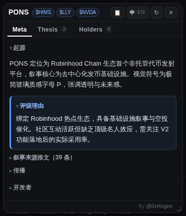
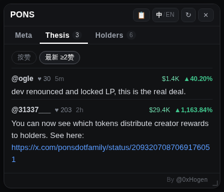
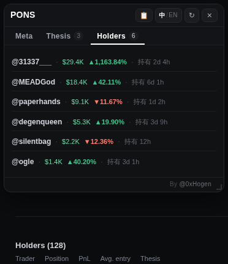

# Fomo放大镜 (Fomo Helper)

[English](README.md) · **中文**

在 [fomo.family](https://fomo.family) 浏览代币时，把 DeBot 叙事、社区 Thesis、持仓者结构与来源推文聚成一张浮动卡片——不用为了看一眼叙事另开三个标签页。

零后端 · 不采集任何数据 · 开源 MIT · 只在 fomo.family 注入 · Chrome / Edge / Brave

[⬇ 下载最新版 zip](https://github.com/mickeyhogen/fomo-helper/releases/latest) · [图文说明页](https://hogen.pro/fomo-helper) · [隐私说明](PRIVACY.md) · [更新日志](CHANGELOG.md) · by [@0xHogen](https://x.com/0xHogen)

卡片默认停靠在左栏右缘，压在图表区上方——不遮代币信息条、不吃下方 Holders 表。

## 卡片里有什么

进入任意代币页，卡片自动弹出（可关）。顶部三个标签，是同一个问题的三个层次：这币讲的什么故事，社区拿什么理由持仓，掏钱的都是谁。

### Meta — 这币是什么

DeBot 的叙事分析全量呈现：起源与评级理由默认摊开，来源推文 / 传播 / 开发者收成一行标题点开看。占位套话（"暂无"、"未发现"之类）自动过滤。币名右侧的小蓝 chips 是这只币的**副池交易对**（如 `$HIMS` `$LLY` `$NVDA`）——ETH / 稳定币这类谁都有的主池不占位，只显示有信息量的配对，悬停看各池流动性。

### Thesis — 持有人自己怎么说

Holders 表里每个持有人对这只币写下的 thesis：按点赞降序全量列出、去重，行头带这位持有人的仓位与盈亏——先看他押了多少钱，再听他讲道理。页顶可切「按赞」/「最新 ≥2赞」两种排序，「最新」档直接读 fomo 自家的 Thesis 评论流，按发言时间新→旧。非中文观点自动补译文（需 Chrome 内置翻译），原文保留。

### Holders — 掏钱的都是谁

按仓位取前 6，一行看全：谁、多大仓位、赚赔多少、拿了多久（`@名字 · $27.4K ▲34.76% · 持有 2d 4h`）。成本悬停整行可见，代币数量这类流水账不上卡。

### 悬停预览 — 不用点进去

鼠标在左栏 Alerts / Feed 的某一行上停住 0.6 秒，卡片浮出该币预览；点 📌 固定。快速划过一串行不会误触发。

### 一切可调

自动弹出三档（精简 / 全展开 / 关闭）、默认语言、悬停预览开关，都在扩展图标的设置面板里。就这三项——没有账号、没有登录、没有要你填的地址，装完就能用。卡片头部的 `中/EN` 随时切换语言。

## 它碰得到什么，碰不到什么

它没有后端，所以它连"偷偷上传"这个动作都做不到。项目里没有任何服务器代码，也没有账号体系。设置只写在你浏览器本地的 `chrome.storage`，卸载即清除。它不读你的 fomo 登录态——Thesis 与 Holders 两页是直接读页面上 fomo 自己已经渲染好的内容，一个网络请求都不发。它也只活在 `fomo.family` 一个域名上。

拉取叙事、推文和池子要向三个第三方公开接口发查询，它们的服务器能在自己日志里看到「某 IP 查询了某代币」——这是拉取式工具绕不开的，但我们既没有服务器也收不到。介意的话可以只用 Thesis / Holders 两页，那两页零网络。

| 接触点 | 用途 | 性质 |
|---|---|---|
| `app.debot.ai` | 拉取代币叙事分析 | 公开接口，不登录、不带 cookie、无 key |
| `fomo.family` 页面 DOM | Thesis 与 Holders | 零网络：只读页面上已渲染的内容，不碰你的登录态 |
| `api.fxtwitter.com` | 叙事来源推文正文 | 公开只读，不登录、不发帖 |
| `api.dexscreener.com` | 副池交易对 chips | 公开只读，不登录、无 key |
| `api.github.com` | 版本检测（每 6 小时，可关） | 公开只读，不登录、无 key，不发送页面/代币信息 |

公开版没有"自定义数据源"这个功能：那意味着扩展要替你去访问一个任意地址，公开发布后就是别人做内网探测的入口。所以设置里没有这一项，代码里没有对应请求路径，manifest 里也不申请任何通配域名权限。详见 [PRIVACY.md](PRIVACY.md)。

## 装上它

不经过应用商店，直接加载源目录，一分钟。Chrome / Edge / Brave 通用（Safari、Firefox 不支持）。

1. **下载并解压** —— [下载最新版 zip](https://github.com/mickeyhogen/fomo-helper/releases/latest)，解压出 `fomo-helper` 文件夹。Windows 上右键 →「全部解压缩…」，不要双击进 zip 直接用。
2. **把文件夹放到一个固定位置** —— 比如 `~/Documents/Extensions/`（Windows `C:\Extensions\`）。浏览器每次启动都从这个文件夹读扩展，放在下载目录里哪天清理就没了。
3. **开启开发者模式** —— 地址栏输入 `chrome://extensions`（Edge 用 `edge://extensions`），打开右上角「开发者模式」。
4. **加载已解压的扩展程序** —— 点该按钮，选中含 `manifest.json` 的那个文件夹。工具栏出现图标即安装成功。
5. **打开 fomo.family** —— 点进任意代币页，卡片自动弹出。不需要登录、不需要同步。

**更新：** 下载新版 zip，解压覆盖原来的文件夹，回 `chrome://extensions` 点该扩展卡片上的 ↻。配置不会丢——扩展 ID 是固定的，挪目录重装也在。想收到新版提醒，在 GitHub 上 Watch → Custom → Releases。

## 不对劲的时候

- **装好了，页面上什么都没出现** —— 它只在 `fomo.family` 生效。先刷新 fomo 页面；仍没有就到 `chrome://extensions` 确认已启用，点 ↻ 再回来。没有自动弹卡时，代币页右下角有个 `🔍` 圆钮，点它也能打开。
- **Thesis / Holders 两页空空的，或者比页面上少** —— 先看 fomo 的 **Friends only** 筛选是不是开着。这两页只读页面已经渲染出来的内容，筛选开着表里只剩好友，扩展也就只能看见这些。想看全量，把筛选切回全部即可；扩展侦测到时空状态会直接写明。
- fomo 界面切成中文 / 日文 / 德文 / 西班牙文 / 法文都能正常抓取（词表取自 fomo 自己的语言包）。
- 默认每 6 小时查一次本项目有没有新版本，有就在卡片页尾提示一行；设置面板里可以关掉。
- **开着 Chrome 网页翻译时 Thesis / Holders 一直空** —— 浏览器翻译会把 fomo 表格里的英文改成中文，扩展认不出表。地址栏翻译图标 → 「显示原文」（或「一律不翻译此网站」）→ 刷新。卡片空态会直接提示这一条。
- **Thesis / Holders 是灰字「把 Holders 表滚动到可见」** —— fomo 的表格是懒加载的。表一渲染出来卡片会在 25 秒内自动补上；把 Holders 表滚到可见能立刻触发。灰字不是报错。
- **「最新」排序没有时间** —— 「最新」档读 fomo 的 Thesis 评论流，点开过那个 tab 一次即可。
- **这个币显示「没有叙事」** —— DeBot 没收录这个币，是数据侧的事实。Thesis / Holders 不受影响。
- **它会碰我的 fomo 登录态或钱包吗** —— 不会。不向 fomo 发任何网络请求，不读取、不存储、不外发任何令牌，没有触碰钱包的权限。
- **为什么不显示星级评分** —— DeBot 的 1–5 星是主观打分，公开版默认不显示，避免被当成投资建议；评级理由的文字保留。
- **更新会丢配置吗 / 换台电脑呢** —— 同一浏览器内更新、挪目录、重装都不丢；换电脑 / 换浏览器不跟随——所有数据只存本地。
- **fomo 改版之后有些内容抓不到了** —— Thesis / Holders 靠页面文本特征解析（fomo 的 CSS 类名是哈希化的），大改版可能让它们退化成灰字提示；Meta 页不受影响。遇到了请开 [Issue](https://github.com/mickeyhogen/fomo-helper/issues)，修起来通常很快。

---

Fomo放大镜是独立的第三方开源工具，与 fomo.family、DeBot 及相关方无任何隶属、授权或合作关系，所有商标归各自所有者。卡片聚合展示的均为公开数据；任何内容都不构成投资建议。

MIT © 2026 [0xHogen](https://x.com/0xHogen) · 设计细节长文：[docs/DETAILS.zh-CN.md](docs/DETAILS.zh-CN.md)
